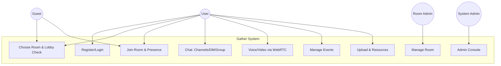
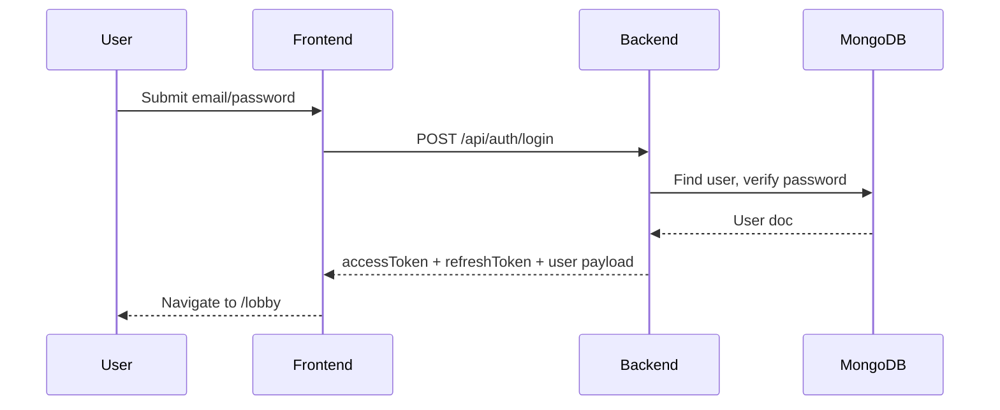
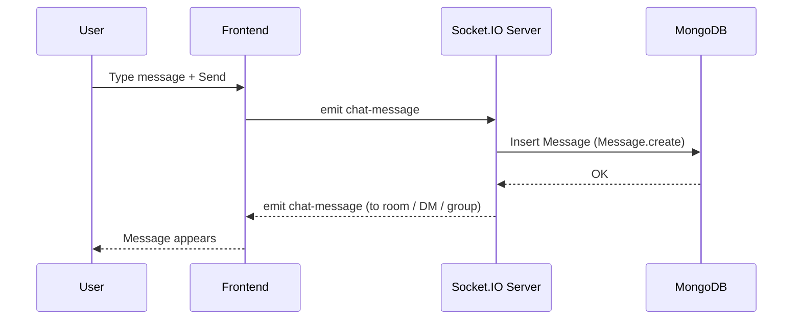
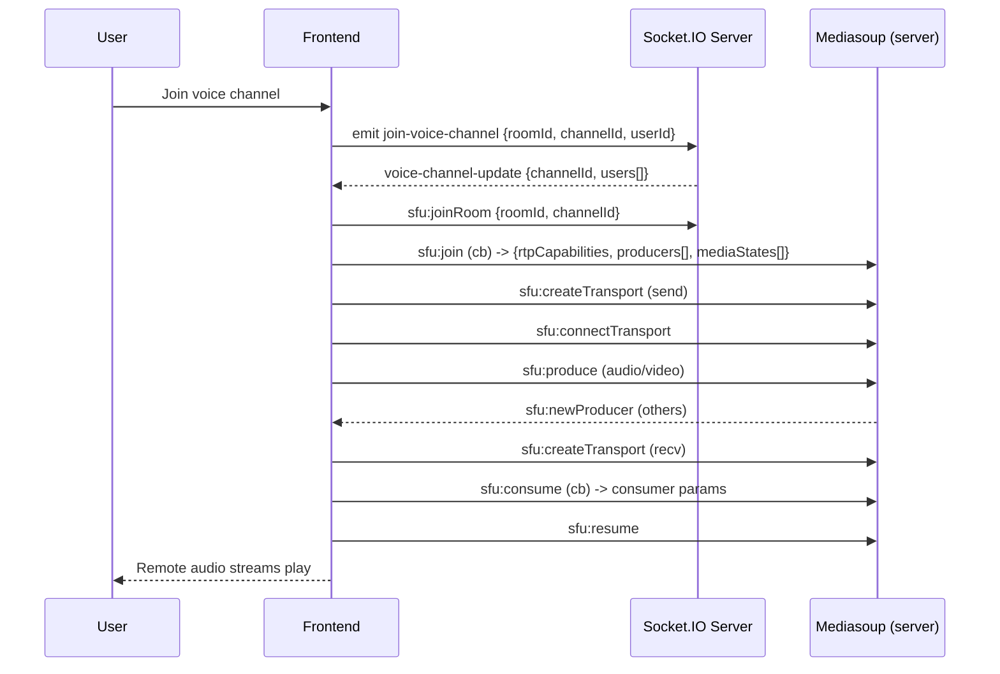
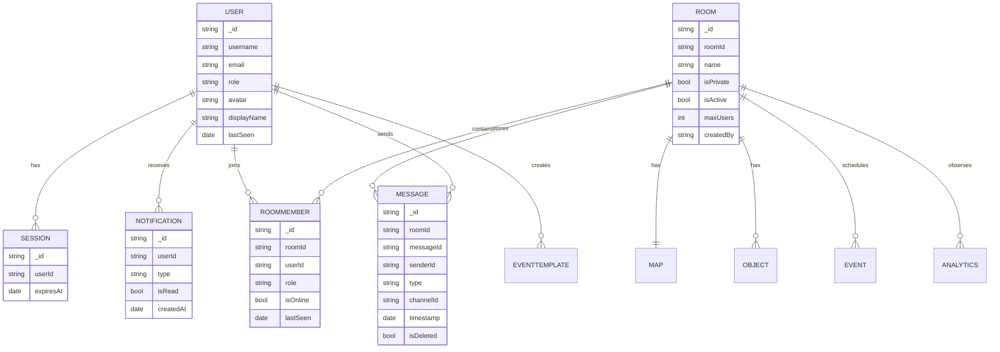

# Software Requirements Specification (SRS) – Gather

> Project: **Gather (Gather Town Clone)**  
> Last updated: **2026-02-08**  
> Scope: Frontend + Backend + Realtime (Socket.IO + WebRTC/SFU)

## Revision history

| Version | Date       | Description                                                                                                      |
| ------: | ---------- | ---------------------------------------------------------------------------------------------------------------- |
|     0.1 | 2026-02-06 | Viết lại requirements cho Gather dựa trên SRS mẫu, đối chiếu với codebase hiện tại.                              |
|     0.2 | 2026-02-08 | Bổ sung assumptions/dependencies, out-of-scope riêng, validation rules, error strategy, deployment/env, roadmap. |

## 1. Purpose

Tài liệu này mô tả yêu cầu phần mềm (functional + non-functional) cho dự án **Gather** – một không gian làm việc ảo 2D kiểu Gather Town. Mục tiêu là thống nhất phạm vi, hành vi hệ thống, tiêu chí nghiệm thu và ràng buộc triển khai.

## 2. Scope

### 2.1 In scope

Gather cung cấp:

- Không gian 2D (Phaser) với người dùng di chuyển, hiện diện theo phòng.
- Chat theo kênh / DM / nhóm, reaction, chỉnh sửa/xoá tin nhắn.
- Kênh thoại (voice channels) và gọi audio/video theo proximity hoặc theo kênh.
- Quản lý phòng (spaces/rooms), mời tham gia, phân quyền cơ bản.
- Event/Calendar, thư viện tài nguyên, upload, thông báo, tìm kiếm.
- Trang Admin cho quản trị hệ thống.

### 2.2 Out of scope (version hiện tại)

Các hạng mục sau **không thuộc phạm vi** của phiên bản hiện tại (có thể xem như future work):

- Thanh toán/subscription, multi-tenant enterprise billing.
- Ghi hình/recording cuộc gọi.
- Mobile native app (iOS/Android) (web responsive có thể có, nhưng không cam kết UX ngang native).
- End-to-end encryption (E2EE) cho media.
- High-availability multi-region deployment / auto-scaling theo tải.

### 2.3 Assumptions & dependencies

**Assumptions (giả định):**

- Số người tối đa trong 1 room theo cấu hình `Room.maxUsers` (mặc định 20 trong codebase).
- Người dùng chủ yếu truy cập qua desktop browser; mobile chỉ yêu cầu responsive cơ bản.
- Audio/video chỉ bật khi user chủ động (permission browser + toggle).

**Dependencies (phụ thuộc):**

- Google OAuth (nếu bật) phải sẵn sàng và hợp lệ cấu hình `GOOGLE_CLIENT_ID/SECRET`.
- Hạ tầng STUN/TURN ổn định để tăng tỷ lệ kết nối WebRTC trong production.
- Trình duyệt hỗ trợ WebRTC (Chrome/Edge/Firefox hiện đại) và HTTPS trên production.

### 2.4 Future enhancements (roadmap ngắn)

- Mobile app (native) và tối ưu UX trên màn hình nhỏ.
- Recording/meeting recap.
- Permission chi tiết hơn (role theo kênh/zone, moderator tools).
- Spatial audio nâng cao + tối ưu proximity.
- Analytics nâng cao (funnel, retention) và dashboard cho admin.

## 3. Definitions

- **Space/Room**: Một không gian làm việc ảo (phòng) có bản đồ, người dùng, kênh chat/voice, events.
- **User**: Người dùng đã đăng nhập.
- **Guest**: Người dùng chưa đăng nhập (tuỳ cấu hình; hiện hệ thống có thể cho vào lobby/app theo local state).
- **Presence**: Trạng thái hiện diện (online/offline, vị trí, hướng, hoạt động).
- **Channel**: Kênh chat/voice trong một room.
- **SFU**: Selective Forwarding Unit (mediasoup) để tối ưu audio/video nhóm.
- **OTP**: One-time password dùng để xác thực email (tuỳ luồng).

---

## 4. Overview

### 4.1 System Boundary

Hệ thống bao gồm:

- **Frontend Web**: UI, game scene (Phaser), chat UI, lobby/dashboard.
- **Backend API**: REST API (Express) cho auth/users/spaces/world/events/resources…
- **Realtime Gateway**: Socket.IO cho presence/chat/control.
- **Media Plane**: WebRTC P2P hoặc SFU (mediasoup) cho audio/video.
- **Database**: MongoDB cho dữ liệu bền vững.

### 4.2 External Entities

- **Google Identity**: đăng nhập OAuth.
- **Email/SMPP provider** (nếu bật OTP gửi mail): gửi OTP/password reset.
- **STUN/TURN** (tuỳ triển khai): hỗ trợ NAT traversal cho WebRTC.

### 4.3 Interactions (Context)

```mermaid
flowchart LR
  U[User/Guest
Browser] -->|HTTPS| FE[Frontend (React + Phaser)]
  FE -->|REST /api/*| BE[Backend (Express)]
  FE <--> |Socket.IO| RT[Realtime Gateway (Socket.IO)]
  BE <--> DB[(MongoDB)]
  FE <--> |WebRTC| MP[Media Plane
P2P or SFU]
  MP <--> SFU[Mediasoup SFU]
  BE -->|OAuth| GOOG[Google Identity]
  BE -->|SMTP| MAIL[Email Provider]
```

---

## 5. Business goals / constraints / criteria

### 5.1 Business goals

- Tạo trải nghiệm “virtual office” trực quan, realtime, dễ tham gia.
- Giao tiếp đa kênh: text + audio/video, hỗ trợ teamwork.
- Dễ vận hành: có admin, logging, rate limit, bảo mật cơ bản.

### 5.2 Business constraints

- Chạy được trên hạ tầng phổ thông (Node.js + MongoDB).
- Tối ưu mạng: giảm spam event, batch movement, giới hạn message query.
- Ưu tiên an toàn: validation, sanitize, rate limit, lockout.

### 5.3 Success criteria (Definition of Done)

- Người dùng đăng ký/đăng nhập thành công, token hoạt động.
- Người dùng vào room, thấy presence realtime, chat hoạt động.
- Audio/video hoạt động trong điều kiện mạng thông thường.
- Admin xem và quản lý room cơ bản.

---

## 6. Functional Requirements List

Quy ước:

- **Priority**: P0 (must), P1 (should), P2 (nice).
- **Complexity**: S (small), M (medium), L (large).

| ID    | Requirement                                               | Priority | Complexity |
| ----- | --------------------------------------------------------- | -------: | ---------: |
| FR-01 | Đăng ký tài khoản bằng email/password (có thể kèm OTP)    |       P0 |          M |
| FR-02 | Đăng nhập email/password, nhận access token               |       P0 |          M |
| FR-03 | Đăng nhập bằng Google OAuth                               |       P1 |          M |
| FR-04 | Làm mới phiên (refresh) / quản lý sessions                |       P1 |          M |
| FR-05 | Người dùng cập nhật hồ sơ (username, avatar…)             |       P1 |          S |
| FR-06 | Xem danh sách spaces/rooms (public + của tôi)             |       P0 |          M |
| FR-07 | Tạo room (private/public, name, roomId tuỳ chọn)          |       P0 |          M |
| FR-08 | Xoá room (owner/admin) + cascade delete dữ liệu liên quan |       P1 |          M |
| FR-09 | Tạo invite link để mời vào room                           |       P0 |          S |
| FR-10 | Lobby: chọn room, kiểm tra camera/mic trước khi vào       |       P0 |          M |
| FR-11 | Vào room: load map + objects theo roomId                  |       P0 |          M |
| FR-12 | Di chuyển avatar realtime + đồng bộ vị trí                |       P0 |          L |
| FR-13 | Hiển thị user online/offline + lastSeen                   |       P0 |          M |
| FR-14 | Chat lịch sử theo room + phân trang/limit                 |       P0 |          M |
| FR-15 | Chat theo kênh text (global channels)                     |       P0 |          L |
| FR-16 | DM 1-1 trong room                                         |       P1 |          M |
| FR-17 | Group chat: tạo nhóm + nhắn trong nhóm                    |       P1 |          M |
| FR-18 | Reaction vào tin nhắn                                     |       P1 |          M |
| FR-19 | Edit/Delete message (theo quyền)                          |       P1 |          M |
| FR-20 | Voice channels: join/leave, danh sách user trong kênh     |       P0 |          L |
| FR-21 | Audio/Video call theo proximity hoặc theo voice channel   |       P0 |          L |
| FR-22 | Screen share (bật/tắt)                                    |       P2 |          L |
| FR-23 | Events: tạo/sửa/xoá event trong room, RSVP/attendance     |       P1 |          M |
| FR-24 | Notifications: nhận và xem thông báo                      |       P1 |          M |
| FR-25 | Upload resources/attachments, truy cập lại qua URL        |       P1 |          M |
| FR-26 | Search: tìm tin nhắn/tài nguyên/người dùng (phạm vi room) |       P1 |          M |
| FR-27 | Admin: gán quyền admin, quản lý rooms/messages cơ bản     |       P1 |          M |
| FR-28 | Analytics: endpoint theo dõi thống kê cơ bản              |       P2 |          M |

---

## 7. Use Cases

### 7.1 Actors

- **Guest**: tham gia lobby/room theo cấu hình.
- **User**: sử dụng đầy đủ tính năng trong room.
- **Room Admin**: quản trị room (xoá room, quản trị đối tượng/thiết lập nếu có).
- **System Admin**: quản trị hệ thống (admin panel).

### 7.2 Use Case Diagram (high-level)



### 7.3 Use Case Description (sample)

#### UC-01 Register account

- **Primary actor**: User
- **Preconditions**: Email chưa tồn tại trong hệ thống.
- **Main flow**:
  1. User nhập username/email/password.
  2. (Tuỳ chọn) User nhập OTP nếu hệ thống yêu cầu.
  3. Hệ thống validate input, tạo user, tạo session.
  4. Trả về access/refresh token và thông tin user.
- **Postconditions**: User có thể truy cập dashboard/spaces.
- **Acceptance criteria**:
  - Password phải đạt chính sách độ mạnh và không thuộc common passwords.
  - Nếu OTP sai/hết hạn thì trả lỗi rõ ràng.

#### UC-02 Join a room

- **Primary actor**: User/Guest
- **Preconditions**: Có `roomId` hợp lệ hoặc tạo mới.
- **Main flow**:
  1. User vào Lobby, bật/tắt camera/mic.
  2. User nhấn Join.
  3. Frontend kết nối Socket.IO với `roomId`, gửi presence.
  4. Frontend load map/objects và hiển thị scene.
- **Postconditions**: User xuất hiện trong danh sách users + hiển thị trên map.
- **Acceptance criteria**:
  - Nếu không có camera/mic vẫn cho phép vào room.
  - Nếu room không tồn tại, hệ thống trả lỗi hoặc tự tạo theo chính sách.

---

## 8. Key Flows (Mermaid)

### 8.1 Auth (Login)



### 8.2 Realtime Chat (send message)



### 8.3 Voice channel join (SFU mode)



---

## 9. Non-Functional Requirements

### 9.1 Security

- NFR-S1: Input phải được sanitize (body/query) để giảm XSS/NoSQL injection.
- NFR-S2: Rate limiting cho endpoint nhạy cảm (auth, API chung).
- NFR-S3: Account lockout sau nhiều lần đăng nhập sai.
- NFR-S4: RBAC tối thiểu (admin vs member) cho admin endpoints.

### 9.2 Performance

- NFR-P1: Chat history endpoint hỗ trợ pagination và limit cứng (≤ 500).
- NFR-P2: Movement/presence có throttling hoặc batch updates để giảm network traffic.

### 9.3 Availability & Reliability

- NFR-A1: Có health check endpoint cho monitoring.
- NFR-A2: Reconnect Socket.IO không gây “flicker” online/offline (debounce).

### 9.4 Usability

- NFR-U1: Lobby cho phép vào room ngay cả khi từ chối camera/mic.
- NFR-U2: UI hỗ trợ responsive ở mức cơ bản cho màn hình nhỏ.

### 9.5 Compatibility

- NFR-C1: Hỗ trợ Chrome/Edge/Firefox bản hiện đại.
- NFR-C2: WebRTC yêu cầu HTTPS trên môi trường production.

### 9.6 Data validation rules (high-level)

- Username: 3–24 ký tự, chỉ `[a-zA-Z0-9._-]` (không khoảng trắng đầu/cuối), case-insensitive unique trong 1 room khi join.
- Message content: tối đa 2000 ký tự; attachments (nếu có) phải có metadata tối thiểu (name/type/url).
- IDs (roomId/messageId/...): chỉ cho phép chuỗi ngắn an toàn (slug/uuid), không nhận object để tránh NoSQL injection.
- Pagination: enforce `limit` min/max theo từng endpoint (vd chat history max 500; search max 100).
- Upload: tối đa 10MB/file (đã nêu), whitelist mime; (tuỳ triển khai) có thể áp quota theo user/ngày để tránh abuse.

### 9.7 Error handling strategy (high-level)

- REST: phân loại `4xx` (client) và `5xx` (server); payload lỗi tối thiểu `{ message }` (một số endpoint có `{ success:false, ... }`).
- Rate limit (HTTP): trả `429` và các header `X-RateLimit-*` như phần conventions.
- Realtime (Socket.IO): lỗi nghiệp vụ gửi qua event `app-error` `{ message }`; ưu tiên **soft-fail** (client vẫn hoạt động các chức năng khác).
- Media/WebRTC: nếu lỗi join/produce/consume thì client nên fallback (ví dụ: voice-only, hoặc P2P nếu SFU không khả dụng) và hiển thị trạng thái rõ ràng.

---

## 10. System Constraints

- SC-01: Backend chạy Node.js 20+.
- SC-02: Database là MongoDB, yêu cầu index hợp lý cho messages.
- SC-03: CORS phải cấu hình theo `CLIENT_URL`.
- SC-04: WebRTC phụ thuộc NAT; production nên có TURN để tăng tỷ lệ kết nối.
- SC-05: Media + realtime tiêu tốn băng thông; cần giới hạn số peers hoặc bật SFU.

### 10.1 Deployment / environments (optional)

- **Development**: chạy local (Vite + Node/Express + MongoDB local), ưu tiên DX.
- **Staging** (khuyến nghị): giống production để test WebRTC/TURN, rate-limit và CORS.
- **Production**: bắt buộc HTTPS; cấu hình CORS chặt; theo dõi health check + log; có TURN để tăng reliability WebRTC.

### 10.2 Key environment variables (tham khảo từ codebase)

- Core: `PORT`, `NODE_ENV`, `MONGODB_URI`, `JWT_SECRET`, `CLIENT_URL`.
- OAuth/anti-bot (optional): `GOOGLE_CLIENT_ID`, `GOOGLE_CLIENT_SECRET`, `GOOGLE_RECAPTCHA_SECRET_KEY`.
- Email/OTP (optional): `EMAIL_USER`, `EMAIL_PASS`.
- SFU/mediasoup tuning (khi dùng SFU): `WEBRTC_LISTEN_IP`, `WEBRTC_ANNOUNCED_IP`, `WEBRTC_MIN_PORT`, `WEBRTC_MAX_PORT`, `WEBRTC_INITIAL_BITRATE`, `MEDIASOUP_LOG_LEVEL`, `MEDIASOUP_LOG_TAGS`.

---

## 11. Backend Requirements

- BR-01: REST API theo nhóm route: auth, spaces, world, chat, users, uploads, resources, notifications, search, admin.
- BR-02: Socket.IO events cho presence/chat/voice/webrtc signaling.
- BR-03: Logging + error handler + 404 handler.

## 12. Frontend Requirements

- FRN-01: React + Router: landing/login/register/dashboard/lobby/app/chat.
- FRN-02: Phaser scene hiển thị map tile + avatar movement.
- FRN-03: Contexts/hook quản lý Socket, Chat, WebRTC, Theme, Notifications.
- FRN-04: Tailwind CSS cho UI components.

## 13. Realtime/Media (SFU) Requirements

- MR-01: Hỗ trợ P2P mode và SFU mode (config bằng env).
- MR-02: Toggle audio/video, share screen.
- MR-03: Quản lý “camera lock” giữa nhiều tab để tránh conflict.

---

## 14. Traceability (optional)

Bản yêu cầu này phản ánh các nhóm module chính trong codebase:

- Frontend: contexts (`ChatContext`, `WebRTCContext`), pages (`Lobby`, `Spaces`, `ChatPage`).
- Backend: routes (`auth`, `spaces`, `world`, `chat`) và realtime trong server.

---

## 15. External Interface Requirements (Detailed)

Mục tiêu phần này là “đóng băng” (freeze) contract để frontend/mobile/QA có thể dựa vào mà test/triển khai ổn định.

### 15.1 Conventions

#### 15.1.1 Base URLs

- REST API base: `/api/*`
- Health: `/health` và `/api/health`
- Upload serving: `/api/uploads/:filename` (cùng host với API)

#### 15.1.2 Authentication

- Cơ chế: `Authorization: Bearer <accessToken>`
- Access token:
  - JWT, payload tối thiểu: `{ userId, type: "access" }`
  - TTL: 15 phút
- Refresh token:
  - Random string (không phải JWT), lưu trong collection `sessions`
  - TTL: 7 ngày
- Các endpoint `optionalAuthenticate` không bắt buộc token nhưng nếu có token hợp lệ thì hệ thống gắn `(req as any).userId` để có thể trả kết quả “tốt hơn”.

#### 15.1.3 Common error patterns

- Nhiều endpoint trả về `res.status(X).json({ message: string })`.
- Rate limit (HTTP): `429` với `{ success:false, message, retryAfter }` và các header:
  - `X-RateLimit-Limit`
  - `X-RateLimit-Remaining`
  - `X-RateLimit-Reset`
- Lỗi realtime (Socket.IO): event `app-error` với payload `{ message: string }`.

#### 15.1.4 Pagination

- Dạng 1 (page/limit): `page`, `limit` → trả về `{ pagination: { page, limit, total, pages? } }`
- Dạng 2 (skip/limit): `skip`, `limit` → trả về `{ pagination: { total, limit, skip, hasMore } }`

---

## 15.2 REST API Specification (Exhaustive)

### 15.2.1 Health

#### GET `/health`

- Auth: No
- Response `200`:
  - `{ status: "healthy", timestamp, uptime, database: "connected"|"disconnected" }`

#### GET `/api/health`

- Auth: No
- Response `200`: `{ status: "ok", message: "Server is running" }`

---

### 15.2.2 Auth (`/api/auth`)

> Các endpoint auth chịu `authRateLimiter`.

#### POST `/api/auth/register`

- Auth: No
- Body:
  - `username` (optional; có thể gửi `fullName` thay thế)
  - `email` (required)
  - `password` (required)
  - `otp` (optional; nếu gửi thì hệ thống validate OTP purpose=`register`)
- Success `201`:
  - `{ accessToken, refreshToken, user: { id, username, email, avatar, role } }`
- Errors:
  - `400` invalid input / password policy / common password / OTP invalid/expired / user exists
  - `500` server error

#### POST `/api/auth/login`

- Auth: No
- Body: `{ email, password, recaptchaToken? }`
- Success `200`: `{ accessToken, refreshToken, user: { id, username, email, avatar, role } }`
- Errors:
  - `400` missing/invalid email
  - `401` invalid credentials
  - `423` account locked (lockoutUntil seconds)
  - `500` server error

#### POST `/api/auth/google`

- Auth: No
- Body: `{ googleId, email, username?, avatar? }`
- Success `200`: `{ accessToken, refreshToken, user: { id, username, email, avatar, role } }`
- Errors: `400`, `500`

#### POST `/api/auth/check-email`

- Auth: No
- Body: `{ email }`
- Success `200`: `{ exists: boolean }`

#### POST `/api/auth/send-otp`

- Auth: No
- Body: `{ email }`
- Success `200`: `{ message, expiresIn: 600 }`

#### POST `/api/auth/forgot-password`

- Auth: No
- Body: `{ email }`
- Success `200`: luôn trả message (tránh email enumeration)

#### POST `/api/auth/verify-otp`

- Auth: No
- Body: `{ email, otp }`
- Success `200`: `{ message: "OTP verified" }`
- Errors: `400`, `500`

#### POST `/api/auth/reset-password`

- Auth: No
- Body: `{ email, otp, newPassword }`
- Success `200`: `{ message: "Password reset successfully" }`
- Errors: `400`, `404`, `500`

#### POST `/api/auth/refresh`

- Auth: No
- Body: `{ refreshToken }`
- Success `200`: `{ accessToken, refreshToken }` (refresh token hiện không rotate)
- Errors: `400`, `401`, `500`

#### POST `/api/auth/logout`

- Auth: No
- Body: `{ refreshToken }`
- Success `200`: `{ message: "Logged out successfully" }`

#### POST `/api/auth/logout-all`

- Auth: Yes (Bearer)
- Success `200`: `{ message, deletedSessions: number }`

#### GET `/api/auth/sessions`

- Auth: Yes (Bearer)
- Success `200`: `{ sessions: Array<SessionWithoutRefreshToken> }`

#### DELETE `/api/auth/sessions/:sessionId`

- Auth: Yes (Bearer)
- Success `200`: `{ message: "Logged out device" }`
- Errors: `400`, `404`

---

### 15.2.3 Users (`/api/users` + alias `/api/user`)

#### GET `/api/users/profile` (alias: `/api/users/me`)

- Auth: Yes (Bearer)
- Success `200`:
  - `{ id, username, email, avatar, status, role, displayName, avatarConfig, profileColor }`

#### PUT `/api/users/profile`

- Auth: Yes (Bearer)
- Body: `{ username?, avatar?, status? }`
- Success `200`: `{ id, username, email, avatar, status }`

#### POST `/api/users/avatar`

- Auth: Yes (Bearer)
- Body: `{ displayName?, avatarConfig? }`
- Success `200`: `{ id, username, displayName, avatarConfig, avatar, message }`

#### GET `/api/users/settings`

- Auth: No
- Response: `{}` (placeholder)

#### GET `/api/users/:userId`

- Auth: No
- Success `200`: public profile (ẩn `password`, `googleId`)

---

### 15.2.4 Spaces/Rooms + Events + Templates (`/api/spaces`)

#### GET `/api/spaces`

- Auth: Optional
- Query:
  - `mine=1` (chỉ có tác dụng khi có auth): trả rooms do user tạo hoặc tham gia
- Success `200`: `{ rooms: Room[] }`
- Behavior:
  - Unauthed: chỉ trả rooms `isPrivate=false` (limit 100)
  - Authed + `mine=1`: rooms là hợp nhất của RoomMember + rooms createdBy
  - Authed (không mine): rooms public + rooms createdBy (limit 200)

#### POST `/api/spaces`

- Auth: Yes (Bearer)
- Body:
  - `roomId?` (nếu trống, server tự sinh)
  - `name?` (default "Không gian của tôi")
  - `description?`
  - `isPrivate?` (boolean)
  - `isActive?` (default true)
  - `maxUsers?` (default 20)
- Success `201`: `{ room }`
- Errors: `409` roomId exists

#### GET `/api/spaces/:roomId`

- Auth: No
- Success `200`: `Room`

#### DELETE `/api/spaces/:roomId`

- Auth: Yes (Bearer)
- Allowed: creator hoặc RoomMember role=`admin`
- Success `200`: `{ message: "Room deleted" }`
- Side effects (best-effort cascade): Room, RoomMember, Map, Object, Event, Message

#### PATCH `/api/spaces/:roomId/status`

- Auth: Yes (Bearer) + admin role
- Body: `{ isActive: boolean }`
- Success `200`: `{ room }`

#### POST `/api/spaces/:roomId/invite`

- Auth: No
- Success `200`: `{ inviteLink, roomId, roomName, maxUsers }`
- Note: inviteLink dạng `${CLIENT_URL}/lobby?room=<roomId>`

##### Legacy alias

- POST `/api/rooms/:roomId/invite` (tương đương)

---

#### Events

##### GET `/api/spaces/:roomId/events`

- Auth: No
- Query: `startDate`, `endDate` (ISO) (optional; khi có cả 2 sẽ filter theo startTime)
- Success `200`: `Event[]`

##### POST `/api/spaces/:roomId/events`

- Auth: Yes (Bearer)
- Body (mô tả theo code):
  - `roomId`, `title`, `description`, `startTime`, `endTime`, `createdBy`, `location`, `maxParticipants`,
  - `isRecurring`, `recurrencePattern`, `templateId`, `reminders` (minutes array)
- Success `201`: `Event`
- Notes:
  - Nếu `templateId` tồn tại: tăng `usageCount` và dùng default fields của template
  - Nếu recurring: tạo các instance event con (không recurring) theo recurrencePattern

##### PUT `/api/spaces/events/:eventId`

- Auth: Yes (Bearer)
- Body: `{ title?, description?, startTime?, endTime?, location? }`
- Success `200`: `Event`

##### POST `/api/spaces/events/:eventId/rsvp`

- Auth: Yes (Bearer)
- Body: `{ userId, username, status: "going"|"maybe"|"not_going" }`
- Success `200`: `Event`
- Error `400`: event full (khi status="going" và vượt maxParticipants)

##### POST `/api/spaces/events/:eventId/attendance`

- Auth: Yes (Bearer)
- Body: `{ userId, attended: boolean }`
- Permission: chỉ `createdBy` của event
- Success `200`: `Event`

##### DELETE `/api/spaces/events/:eventId`

- Auth: Yes (Bearer)
- Success `200`: `{ message }`

---

#### Event templates

##### GET `/api/spaces/templates`

- Auth: No
- Query: `category?`, `publicOnly=true?`
- Success `200`: `EventTemplate[]`
- Behavior:
  - Unauthed: chỉ `isPublic=true`
  - Authed: trả template createdBy=user hoặc public

##### GET `/api/spaces/templates/:templateId`

- Auth: No
- Success `200`: `EventTemplate`

##### POST `/api/spaces/templates`

- Auth: Yes (Bearer)
- Body: `{ name, description?, duration?, defaultLocation?, defaultMaxParticipants?, defaultReminders?, category?, isPublic? }`
- Success `201`: `EventTemplate`

##### PUT `/api/spaces/templates/:templateId`

- Auth: Yes (Bearer)
- Permission: template.createdBy == current user
- Success `200`: `EventTemplate`

##### DELETE `/api/spaces/templates/:templateId`

- Auth: Yes (Bearer)
- Permission: template.createdBy == current user
- Success `200`: `{ message: "Template deleted" }`

---

### 15.2.5 World/Maps/Objects (`/api/world`)

#### Maps

##### GET `/api/world/room/:roomId`

- Auth: No
- Behavior: nếu chưa có map → server tự tạo default map 50x50, tileSize 32
- Success `200`: `Map`

##### PUT `/api/world/room/:roomId`

- Auth: No
- Body: patch-like (tiles/collision/width/height/name/zones/backgroundImage)
- Behavior: nếu chưa có map → tạo default rồi update
- Success `200`: `Map`

##### POST `/api/world/`

- Auth: No
- Body: `{ roomId, name?, width?, height?, tiles?, collision?, backgroundImage? }`
- Error `400`: map already exists for room

#### Objects

##### GET `/api/world/objects/room/:roomId` (legacy: `/api/world/room/:roomId/objects`)

- Auth: No
- Success `200`: `Object[]` (chỉ `isActive=true`)

##### GET `/api/world/objects/:objectId`

- Auth: No
- Success `200`: `Object`
- Error `404`: not found

##### POST `/api/world/objects`

- Auth: No
- Body: `{ roomId, type, name, position, properties?, createdBy? }`
- Success `201`: `Object` (server tự sinh `objectId`)

##### PUT `/api/world/objects/:objectId`

- Auth: No
- Body: update fields (server không whitelist chặt; truyền thẳng vào update)
- Success `200`: `Object`

##### PUT `/api/world/objects/:objectId/whiteboard`

- Auth: No
- Body: `{ content }`
- Success `200`: `Object` (type="whiteboard", update `properties.content`)

##### DELETE `/api/world/objects/:objectId`

- Auth: No
- Behavior: soft delete (`isActive=false`)
- Success `200`: `{ message }`

---

### 15.2.6 Chat history/search (`/api/chat`)

#### GET `/api/chat/history/:roomId`

- Auth: No
- Query:
  - `limit` default 100, max 500
  - `skip` default 0
  - `type?` (nearby/global/dm/group)
  - `channelId?`
- Success `200`:
  - `{ messages: ChatMessage[], pagination: { total, limit, skip, hasMore } }`

#### GET `/api/chat/search/:roomId`

- Auth: No
- Query:
  - `q` (required)
  - `type?`, `channelId?`
  - `limit` default 50, max 100
- Success `200`: `{ query: q, results: ChatMessage[], count }`

---

### 15.2.7 Uploads (`/api/uploads`)

#### POST `/api/uploads/`

- Auth: No
- Content-Type: `multipart/form-data`
- Field: `file`
- Constraints:
  - Max size: 10MB
  - Allowed mimes: jpeg/jpg/png/gif/webp/pdf/txt/doc/docx/xls/xlsx
- Success `200`:
  - `{ success:true, file:{ filename, originalName, mimeType, size, url } }`
- Errors: `400` no file, `500` upload error

#### GET `/api/uploads/:filename`

- Auth: No
- Success: `200` (sendFile)
- Error `404`: `{ success:false, message:"File not found" }`

#### DELETE `/api/uploads/:filename`

- Auth: No
- Success `200`: `{ success:true, message:"File deleted" }`

---

### 15.2.8 Resources (`/api/resources`)

#### GET `/api/resources`

- Auth: No
- Query:
  - `q?` (text search; length > 1)
  - `type?` (`guide|ebook|course|video|audio|other|all`)
  - `approved` default "true"
  - `limit` default 50, max 200
  - `page` default 1
- Success `200`: `{ resources, pagination:{ page, limit, total } }`

#### POST `/api/resources`

- Auth: Yes (Bearer)
- Body: `{ title, author?, content_type?, url?, thumbnail_url?, description? }`
- Success `201`: `{ resource }`
- Notes: resource tạo mới có `isApproved=false` (moderation bởi admin)

---

### 15.2.9 Notifications (`/api/notifications`)

#### GET `/api/notifications`

- Auth: Yes (Bearer)
- Query: `unreadOnly=false|true`, `limit=50`, `page=1`
- Success `200`: `{ notifications, pagination:{ page, limit, total, pages }, unreadCount }`

#### POST `/api/notifications/:notificationId/read`

- Auth: Yes (Bearer)
- Success `200`: `Notification` (đã set `isRead=true`, `readAt`)

#### POST `/api/notifications/read-all`

- Auth: Yes (Bearer)
- Success `200`: `{ message }`

#### DELETE `/api/notifications/:notificationId`

- Auth: Yes (Bearer)
- Success `200`: `{ message }`

---

### 15.2.10 Search (`/api/search`)

#### GET `/api/search`

- Auth: Optional
- Query: `q` (>=2 chars), `types` comma-separated (default: user), `limit=20`, `page=1`
- Success `200`: `{ results, pagination:{ page, limit, total, pages }, query }`

#### GET `/api/search/quick`

- Auth: Optional
- Query: `q` (>=2 chars)
- Success `200`: `{ results }` (top 5 users)

---

### 15.2.11 Analytics (`/api/analytics`)

#### POST `/api/analytics/track`

- Auth: Optional
- Body: `{ eventType, eventName, properties?, sessionId }`
- Constraints: `eventType ∈ {page_view,user_action,error,performance,custom}`
- Success `201`: `{ success:true, id }`

#### GET `/api/analytics/events`

- Auth: Yes (Bearer) + admin role
- Query: `eventType? userId? sessionId? startDate? endDate? limit=100`
- Success `200`: `{ events, count }`

#### GET `/api/analytics/summary`

- Auth: Yes (Bearer) + admin role
- Query: `startDate? endDate?`
- Success `200`: `{ eventTypeCounts, uniqueUsers, uniqueSessions, topEvents }`

---

### 15.2.12 Admin (`/api/admin`) (RBAC: admin)

#### Rooms

- GET `/api/admin/rooms` → list (aggregate member_count, message_count)
- GET `/api/admin/rooms/:roomId` → `{ room, members[] }`
- POST `/api/admin/rooms` → create room (createdBy=null)
- DELETE `/api/admin/rooms/:roomId` → force delete + cascade (Room, RoomMember, Message)
- POST `/api/admin/rooms/:roomId/members` → add member by userId
- DELETE `/api/admin/rooms/:roomId/members/:userId` → remove member

#### Users

- GET `/api/admin/users` (q/page/limit) → list users
- PATCH `/api/admin/users/:userId` → update `{ role?, status?, displayName? }`
- DELETE `/api/admin/users/:userId` → delete

#### Resources moderation

- GET `/api/admin/resources` (q/type/approved/page/limit) → list resources
- PATCH `/api/admin/resources/:resourceId` → `{ isApproved:boolean }`
- DELETE `/api/admin/resources/:resourceId` → delete

---

## 15.3 Socket.IO Realtime Contract (Exhaustive)

### 15.3.1 Common events

- `app-error` (Server → Client): `{ message: string }`
- `room-full` (Server → Client): `{ message, maxUsers, currentUsers }`

### 15.3.2 Presence / Room lifecycle

#### `user-join` (Client → Server)

- Payload: `{ userId: string, username: string, roomId: string, avatar?: string, position?: {x:number,y:number} }`
- Validation/constraints:
  - username không rỗng
  - không trùng username trong cùng room (case-insensitive)
  - room capacity: `Room.maxUsers`
  - room must be active (`Room.isActive !== false`)
- Server side effects:
  - tạo Room nếu chưa tồn tại
  - upsert RoomMember, set `isOnline=true`, `lastSeen`
  - broadcast trạng thái users

#### Events emitted as part of join

- `user-joined` (Server → Room broadcast): `{ userId, username, avatar?, position, direction?, socketId }`
- `room-users` (Server → Room broadcast): `Array<{ userId, username, avatar, position, direction?, status:"online"|"offline", role }>`
- `allPlayersPositions` (Server → Client or Room broadcast): `Array<{ userId, username, avatar, position, direction? }>`
- `room-info` (Server → Room broadcast): `{ roomId, currentUsers, maxUsers }`

#### Disconnect / leave

- On disconnect, server debounce offline 5s (avoid flicker).
- `user-left` (Server → Room broadcast, debounced): `{ userId, username, timestamp }`
- `room-admin-changed` (Server → Room broadcast): `{ roomId, newAdminUserId }` (khi cần auto-promote)

### 15.3.3 Movement

#### `playerMovement` (Client → Server)

- Payload: `{ x?:number, y?:number, position?:{x:number,y:number}, direction?:string }`

#### `playerMoved` (Server → Room broadcast excluding sender)

- Payload: `{ userId, username, position:{x,y}, direction? }`

#### `allPlayersPositions` (Server → Room broadcast)

- Batch interval: 500ms/room

### 15.3.4 Reactions

#### `reaction` (Client → Server)

- Payload: `{ reaction: string, timestamp?: number }`

#### `reaction` (Server → Room broadcast)

- Payload: `{ userId, reaction, timestamp }`

### 15.3.5 Whiteboard

#### `whiteboard-draw` (Client → Server)

- Payload: (free-form; server forwards + inject userId/username)

#### `whiteboard-draw` (Server → Room broadcast excluding sender)

- Payload: `{ ...data, userId, username }`

### 15.3.6 Chat protocol (Socket.IO)

#### `chat-message` (Client → Server)

- Payload (superset; server normalize):
  - `message` hoặc `content`
  - `type`: `nearby|global|dm|group`
  - `targetUserId?`, `groupId?`, `channelId?`
  - `timestamp?`
  - `replyTo?`, `attachments?`
- Constraints:
  - Max length: 2000 chars
  - Rate limit: 8 events / 3s / user
  - Spam window: 5 messages / 3s → temp mute 10s
  - DM cannot target self
- Persistence:
  - Always persisted to MongoDB (`Message.create`) với stable `messageId`
- Outgoing:
  - `chat-message` (Server → recipients) với message object có `id` authoritative

#### `message-reaction` (Client → Server)

- Payload: `{ messageId, emoji, userId, roomId? }`
- Constraints:
  - Rate limit: 25 / 5s / user
  - Không react message đã xóa
  - 1 user tối đa 20 reactions/message
- Outgoing:
  - `message-reaction-updated` (Server → room): `{ messageId, emoji, userId }`

#### `edit-message` (Client → Server)

- Payload: `{ messageId, newContent, userId, roomId? }`
- Constraints:
  - Rate limit: 10 / 5s / user
  - Only sender can edit
  - Not editable when deleted
- Outgoing:
  - `message-edited` (Server → room): `{ messageId, newContent, editedAt, userId }`

#### `delete-message` (Client → Server)

- Payload: `{ messageId, userId, roomId? }`
- Constraints:
  - Rate limit: 10 / 5s / user
  - Only sender can delete
- Outgoing:
  - `message-deleted` (Server → room): `{ messageId, userId }`

#### Channel + group chat creation

- `create-group-chat` → emits `group-chat-created`
- `create-channel` → emits `channel-created`
- `create-voice-channel` → emits `voice-channel-created`

### 15.3.7 Voice channels (non-SFU membership)

#### `join-voice-channel` (Client → Server)

- Payload: `{ channelId, userId, roomId }`
- Constraints:
  - Rate limit: 20 / 10s / user
  - 1 user chỉ ở 1 voice channel/room (auto-leave channel cũ)
  - Max 20 users/channel
- Outgoing:
  - `voice-channel-update` (Server → room & direct): `{ channelId, users: string[] }`
  - `voice-channel-full` (Server → client): `{ channelId, message, maxUsers:20 }`

#### `leave-voice-channel` (Client → Server)

- Payload: `{ channelId, userId, roomId }`
- Constraints: rate limit 20/10s
- Outgoing: `voice-channel-update`

### 15.3.8 WebRTC signaling (P2P)

- `webrtc-offer` (Client → Server): `{ targetUserId, offer }` → Server forwards to target as `{ fromUserId, offer }`
- `webrtc-answer` (Client → Server): `{ targetUserId, answer }` → forwards `{ fromUserId, answer }`
- `webrtc-ice-candidate` (Client → Server): `{ targetUserId, candidate }` → forwards `{ fromUserId, candidate }`

---

## 15.4 SFU (mediasoup) Socket Contract

### 15.4.1 Socket room key

- Room key: `${roomId}:${channelId}`
- Client should call `sfu:joinRoom` to join the Socket.IO room for broadcast events.

### 15.4.2 Events (with callback acks)

#### `sfu:join` (Client → Server, ack)

- Payload: `{ roomId, channelId, userId }`
- Ack (success): `{ ok:true, rtpCapabilities, producers:[{producerId,userId,kind}], mediaStates:[{userId,audioEnabled,videoEnabled}] }`
- Ack (error): `{ ok:false, error }`

#### `sfu:createTransport` (Client → Server, ack)

- Payload: `{ roomId, channelId, direction:"send"|"recv" }`
- Ack success: `{ ok:true, params:{ id, iceParameters, iceCandidates, dtlsParameters } }`

#### `sfu:connectTransport` (Client → Server, ack)

- Payload: `{ roomId, channelId, transportId, dtlsParameters }`
- Ack success: `{ ok:true }`

#### `sfu:produce` (Client → Server, ack)

- Payload: `{ roomId, channelId, transportId, kind:"audio"|"video", rtpParameters }`
- Ack success: `{ ok:true, producerId }`
- Side effect: server emits `sfu:newProducer` to others in `${roomId}:${channelId}`

#### `sfu:consume` (Client → Server, ack)

- Payload: `{ roomId, channelId, transportId, producerId, rtpCapabilities }`
- Ack success: `{ ok:true, params:{ id, producerId, kind, rtpParameters, userId } }`

#### `sfu:resume` (Client → Server, ack)

- Payload: `{ roomId, channelId, consumerId }`
- Ack success: `{ ok:true }`

#### `sfu:leave` (Client → Server)

- Payload: `{ roomId, channelId }`

#### `sfu:joinRoom` (Client → Server)

- Payload: `{ roomId, channelId }`

#### `sfu:mediaState` (Client → Server)

- Payload: `{ roomId, channelId, userId, audioEnabled, videoEnabled }`
- Server broadcast: `sfu:mediaState` to `${roomId}:${channelId}`

#### `sfu:producerClosed` (Server → Client)

- Payload: `{ producerId }`

---

## 16. Data Model (MongoDB/Mongoose)

### 16.1 ER Diagram



### 16.2 Data dictionary (summary)

#### `User`

- Uniques: `username` (unique), `email` (unique sparse), `googleId` (unique sparse)
- Core fields: `username`, `email?`, `password?`, `role`, `avatar`, `displayName?`, `avatarConfig`, `avatarColor`, `status`, `currentRoom`, `position`, `lastSeen`

#### `Room`

- Unique: `roomId`
- Fields: `name`, `description`, `maxUsers` (default 20, min 20), `isPrivate`, `isActive`, `createdBy`

#### `RoomMember`

- Unique compound: `(roomId, userId)`
- Fields: `username`, `avatar`, `joinedAt`, `lastSeen`, `isOnline`, `role`

#### `Message`

- Unique compound: `(roomId, messageId)`
- Fields: `senderId`, `senderName`, `type`, `content`, `targetUserId?`, `groupId?`, `channelId?`, `recipients[]`, `timestamp`, `editedAt?`, `isDeleted`, `deletedAt?`, `deletedBy?`, `replyTo?`, `reactions[]`, `attachments[]`

#### `Map`

- Unique: `mapId`
- Fields: `roomId` (indexed), `width`, `height`, `tileSize`, `tiles[][]`, `collision[][]`, `zones[]`, `backgroundImage?`

#### `Object`

- Unique: `objectId`
- Fields: `roomId`, `type`, `name`, `position`, `properties` (url/content/imageUrl/documentUrl/width/height/allowFullscreen), `isActive`

#### `Event`

- Unique: `eventId`
- Fields: `roomId`, `title`, `description`, `startTime`, `endTime`, `createdBy`, `attendees[]`, `location`, `maxParticipants?`, `isRecurring`, `recurrencePattern?`, `parentEventId?`, `templateId?`, `reminders[]`, `attendance`

#### `EventTemplate`

- Fields: `name`, `duration`, `defaultReminders[]`, `category?`, `createdBy`, `isPublic`, `usageCount`

#### `Notification`

- Fields: `userId`, `type`, `title`, `message`, `link?`, `relatedId?`, `isRead`, `readAt?`

#### `Resource`

- Text index: `title`, `author`
- Fields: `title`, `author?`, `content_type`, `url?`, `thumbnail_url?`, `description`, `createdBy?`, `isApproved`

#### `Session`

- Unique: `refreshToken` (stored server-side)
- TTL: `expiresAt` (expireAfterSeconds: 0)

#### `OtpCode`

- TTL index: `expiresAt` (expires ~15m)
- Fields: `email`, `code`, `purpose`, `used`, `expiresAt`

#### `Analytics`

- TTL index: auto delete after 90 days
- Fields: `eventType`, `eventName`, `sessionId`, `userId?`, `timestamp`, `properties`, `ipAddress?`, `userAgent?`

---

## 17. Detailed Use Cases (Testable)

### UC-Auth-01 Login + session creation

- Preconditions: user exists; account not locked
- Main flow:
  1. Client calls `POST /api/auth/login`.
  2. Server validates credentials, clears lockout counters, updates `lastSeen`.
  3. Server creates `Session` record and returns `{ accessToken, refreshToken }`.
- Alternate flows:
  - A1: wrong password → `401` + remainingAttempts
  - A2: too many attempts → `423` lockout
  - A3: reCAPTCHA enabled and fails → `400`

### UC-Room-01 Join room (Socket)

- Preconditions: room active; capacity not exceeded; username unique
- Main flow:
  1. Client connects Socket.IO.
  2. Client emits `user-join`.
  3. Server upserts Room/RoomMember and broadcasts room state.
  4. Client renders map + presence.
- Errors:
  - E1: duplicate username → `app-error`
  - E2: room full → `room-full`
  - E3: room disabled → `app-error`

### UC-Chat-01 Send message (persisted)

- Preconditions: user joined room
- Main flow:
  1. Client emits `chat-message`.
  2. Server validates spam/rate limit + persists `Message`.
  3. Server emits `chat-message` to đúng recipients (global/nearby/dm/group).

### UC-Voice-01 Join voice channel + SFU streams

- Preconditions: user joined room; voice channel not full
- Main flow:
  1. Client emits `join-voice-channel`.
  2. Client joins socket room via `sfu:joinRoom`.
  3. Client calls `sfu:join` to obtain `rtpCapabilities` + existing producers.
  4. Client creates transports, produces tracks, consumes remote producers.
- Alternate flows:
  - A1: channel full → `voice-channel-full`
  - A2: cannot consume → `sfu:consume` ack `{ ok:false, error:"cannot consume" }`

---

## 18. Traceability Matrix (FR → Implementation)

| Requirement    | Backend (REST)                              | Backend (Socket)                                                     | Models                                                    |
| -------------- | ------------------------------------------- | -------------------------------------------------------------------- | --------------------------------------------------------- |
| FR-01/02/04    | `/api/auth/*`                               | -                                                                    | `User`, `Session`, `OtpCode`                              |
| FR-05          | `/api/users/*`                              | -                                                                    | `User`                                                    |
| FR-06/07/08/09 | `/api/spaces/*`, `/api/rooms/:roomId/*`     | `user-join`, `room-users`, `room-info`                               | `Room`, `RoomMember`, `Map`, `Object`, `Event`, `Message` |
| FR-12/13       | -                                           | `playerMovement`, `allPlayersPositions`, `user-left`                 | `RoomMember`                                              |
| FR-14          | `/api/chat/history/:roomId`                 | -                                                                    | `Message`                                                 |
| FR-15..19      | -                                           | `chat-message`, `message-reaction`, `edit-message`, `delete-message` | `Message`                                                 |
| FR-20/21       | -                                           | `join-voice-channel`, `voice-channel-update`, `webrtc-*`, `sfu:*`    | (SFU in-memory)                                           |
| FR-23          | `/api/spaces/*events*`                      | -                                                                    | `Event`, `EventTemplate`                                  |
| FR-24          | `/api/notifications/*`                      | -                                                                    | `Notification`                                            |
| FR-25          | `/api/uploads/*`, `/api/resources/*`        | -                                                                    | `Resource`                                                |
| FR-26          | `/api/search/*`, `/api/chat/search/:roomId` | -                                                                    | `User`, `Message`, `Resource`                             |
| FR-27          | `/api/admin/*`                              | -                                                                    | `Room`, `RoomMember`, `User`, `Resource`, `Message`       |
| FR-28          | `/api/analytics/*`                          | -                                                                    | `Analytics`                                               |

---

## 19. Known Gaps / Implementation Notes

- Frontend login/register có thể đang đọc `data.token`, trong khi backend trả về `accessToken` và `refreshToken`. Requirement này chuẩn hoá theo backend contract hiện tại.
- Một số REST endpoints (world/objects, uploads) hiện chưa yêu cầu auth; nếu mục tiêu product cần kiểm soát ghi dữ liệu, cần bổ sung auth/authorization ở các route tương ứng.
